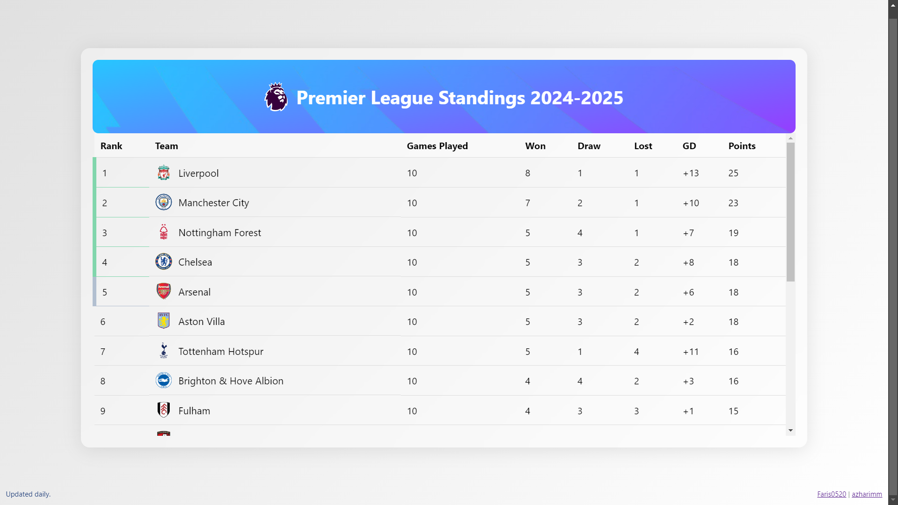

# Premier League Tables Using Python Flask

https://epl.farisdaffa.id

This is my first project using python flask. I hope u like it :)

Credit to [azharimm](https://github.com/azharimm/football-standings-api) for the API's

